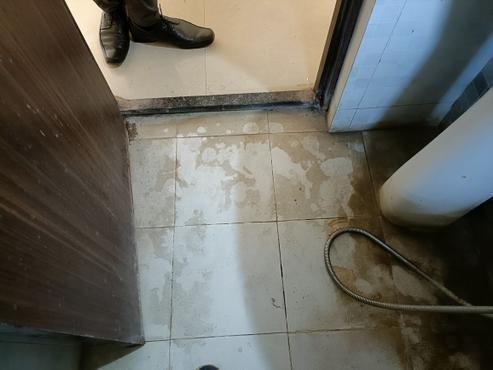
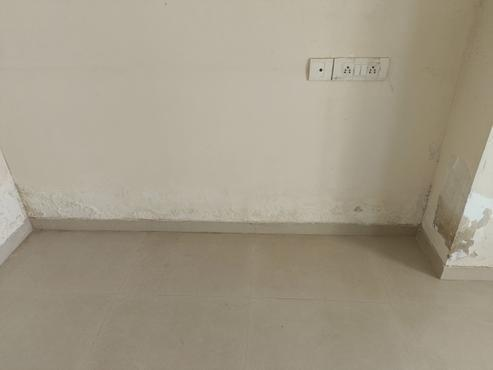
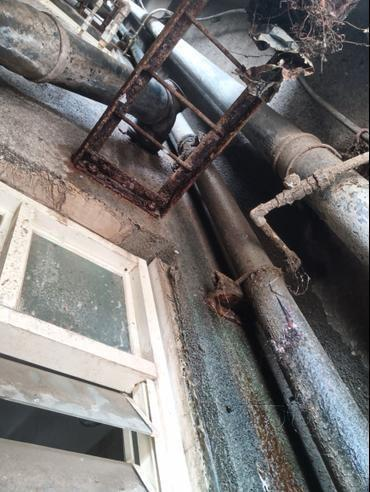
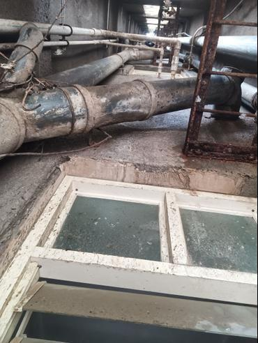
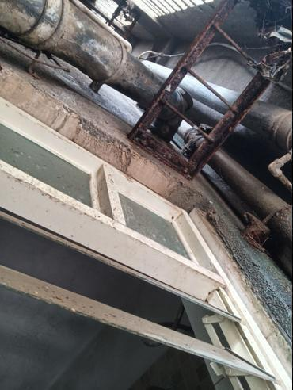
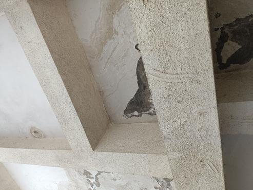
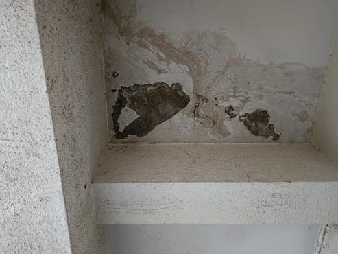

# Property Issue Summary
This report summarizes the issues found during the inspection of the property.

## Issues Found
- Dampness in the Hall, Common Bedroom, Master Bedroom, and Kitchen
- Gaps between tile joints in the Common Bathroom, Master Bedroom Bathroom, and Common & Master Bedroom Bathrooms
- Plumbing issue in the Common Bathroom
- Mild dampness in the Common Bathroom
- Cracks in the External wall
- Algae fungus and Moss on the External wall
- Bird droppings on the External wall (Not Available)
- Chajja on the External wall (Not Available)
- Corrosion on metal rods on the External wall (Not Available)
- MS window grills on the External wall (Not Available)
- Separation cracks in the Plaster (Not Available)
- Leakage in the Parking ceiling and Overhead water tank (Not Available)
- Loose plaster on the External surfaces (Not Available)
- Temperature issues in the Thermal and External wall areas

## Area-wise Observations
### Hall
- Dampness at the skirting level
- 

### Common Bathroom
- Gaps between tile joints
- Plumbing issue
- Mild dampness at the ceiling
- 
- 
- 

### Common Bedroom
- Dampness at the skirting level
- Image Not Available

### Master Bedroom
- Dampness at the skirting level
- Efflorescence on the wall surface
- 
- 

### Master Bedroom Bathroom
- Gaps between tile joints
- 

### External wall
- Cracks
- Algae fungus and Moss
- Bird droppings (Not Available)
- Chajja (Not Available)
- Corrosion on metal rods (Not Available)
- MS window grills (Not Available)
- Temperature: 28.8 C
- 
- 

### Kitchen
- Dampness at the skirting level
- Image Not Available

## Probable Root Cause
The probable root cause of the issues found is the presence of dampness and water leakage in various areas of the property. This could be due to various reasons such as poor drainage, water seepage, or high humidity levels.

## Severity Assessment
The severity of the issues found is moderate to high. The presence of dampness and water leakage can lead to further damage to the property and compromise the health and safety of its occupants.

## Recommended Actions
- Conduct a thorough investigation to identify the root cause of the dampness and water leakage
- Repair or replace any damaged or faulty components such as pipes, gutters, and downspouts
- Implement measures to improve drainage and reduce water seepage
- Address the temperature issues in the Thermal and External wall areas
- Conduct regular maintenance and inspections to prevent further damage

## Additional Notes
- The inspection and thermal details conflict in some areas, which needs to be further investigated
- Some information is missing or unclear, which needs to be obtained from the relevant authorities or parties

## Missing or Unclear Information
- Bird droppings on the External wall
- Chajja on the External wall
- Corrosion on metal rods on the External wall
- MS window grills on the External wall
- Separation cracks in the Plaster
- Leakage in the Parking ceiling and Overhead water tank
- Loose plaster on the External surfaces
- Temperature readings for the Thermal and External wall areas (conflicting details)

## Severity Assessment (with reasoning)
Not Available